# the CNN training test on Cifar10 

### Introduction

> this it the summery of CNN training results on Cifar10 set

## 1. Results before data augmentation

> I trained the cifar10 on different kinds of nets to check out their difference
> The results on Resnet18 with lr = 0.01 are shown as:
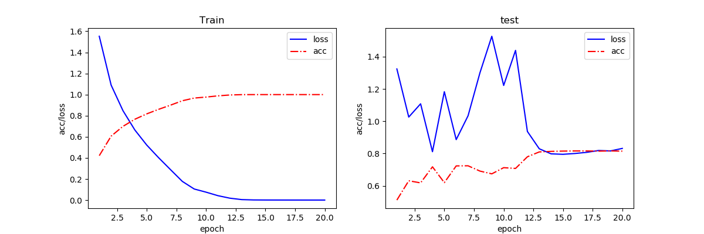
> The results on Resnet50 with lr = 0.01 are shown as:
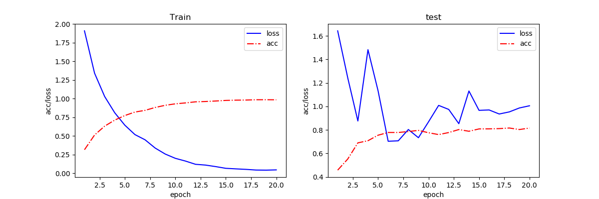
> The results on Resnet101 with lr = 0.01 are shown as:
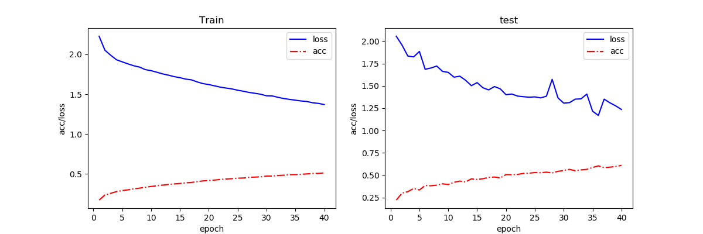
> after training another 20 epoch the results of Resnet101 gets:
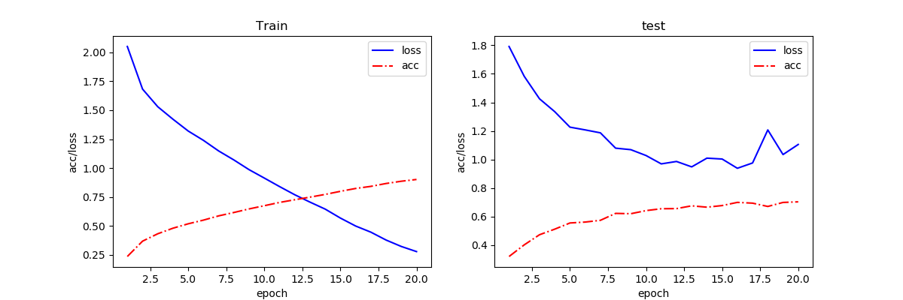

>It shows that the model training with the original set are easily to get overfitted

## 2. Results for changing learning rate by hand on VGG16
> Firstly, I chose lr = 0.001 and set the epoch as 20:
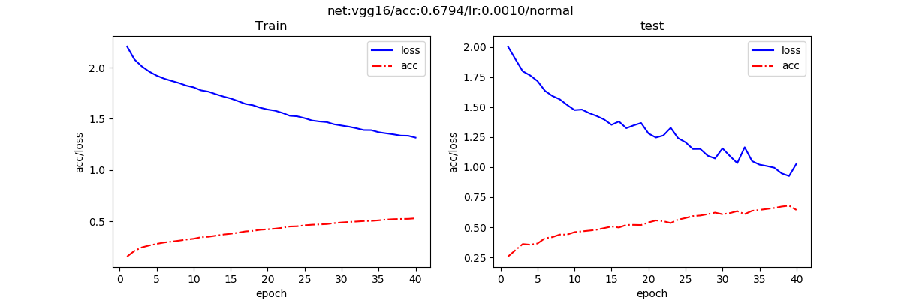
> Then I swich lr to 0.01 with other 20 epochs
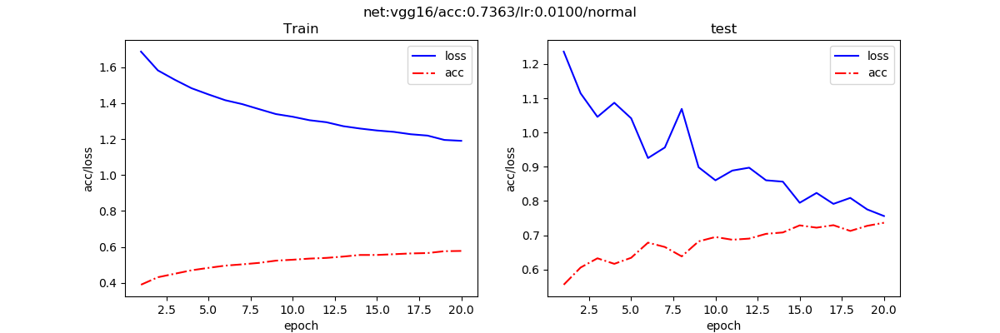
> Finally, the lr was shift back to 0.001 and after 50 epochs, the results are shown as:
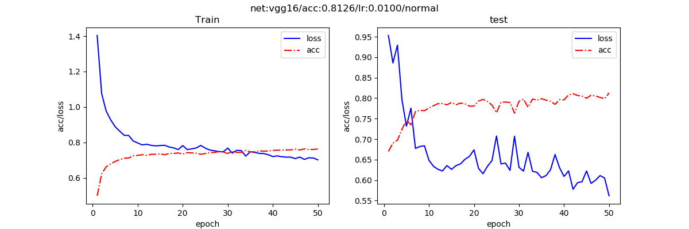
> It might be getting better if there is another 50 epochs, as both the loss and
the acc have room to optimize

## 3. Results for changing learning rate automatically on VGG16
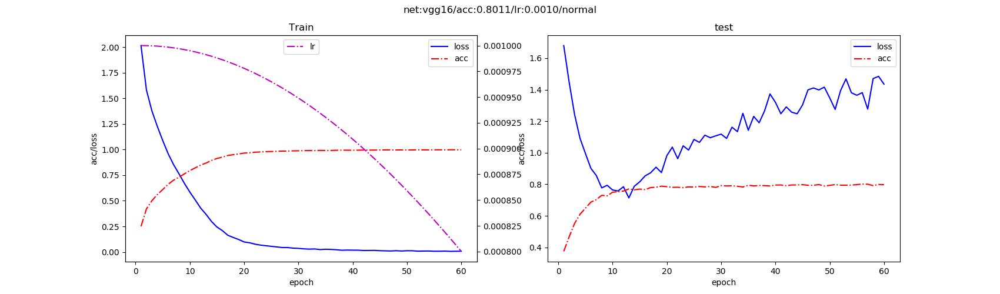

## 4. Results for using data augmentation (Best results till now)
> I augmented the dataset with some flips, corps, rotations and even some gray 
> scale adjudgement, so I had a try on this augmented set with 20 epochs
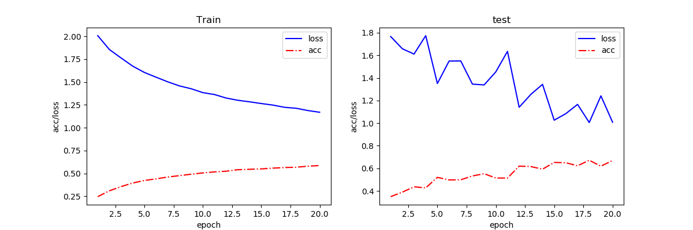
> As shown in the figure, the model is still under training, so I gave it another
>20-epoch, of course, which is under the condition that lr=0.01

> The results curve of test set shakes too much, so I trained it again
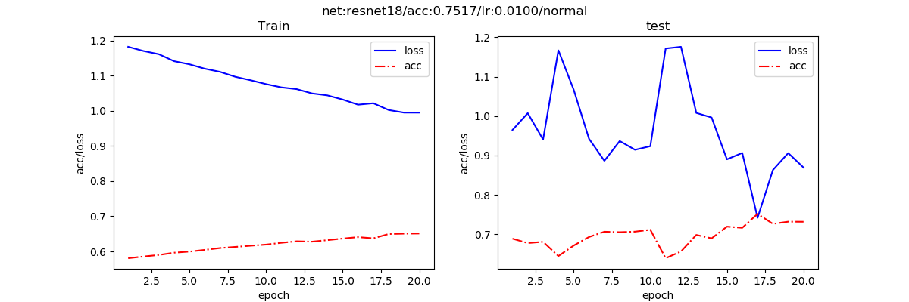
>As we can see from the figure, it shakes even worse that test session behaved terrible
>So, I returned back and load the model achieved by the second training session,
>the results are shown as:
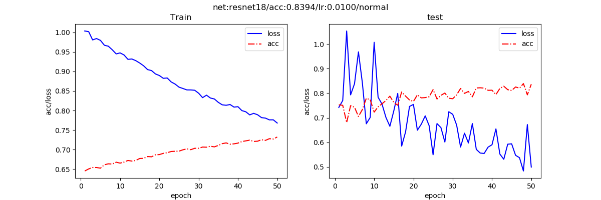
>I think it might because the learning rate is to large that the test results jumps so irregularly
>So I kept my training, but in this time, I modified the lr to 0.001 to prevent 
what happend in the last training session. And after another 20 epochs I got a result as below:
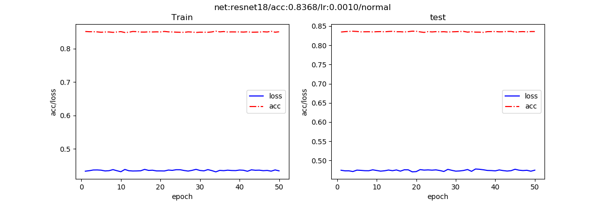
>What? the result presents unbelievablly STABLE! The model cannot be trained any more.
>The loss value, according to the graph, however is not small enouph, which means
that the model has potential to be trained better, but it stopped, why?
Then, I turned my eyes on the augmented dataset, is it possible that I had augmented
the set too much? I then moved back and removed the rotate and gray scale change augmentation
options, and trained 50 epochs.
> TaDaaa, here is the results:
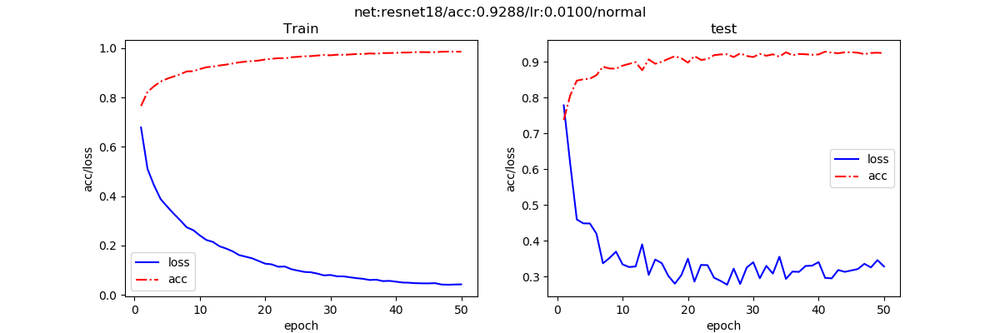

> To verify whether the augmentation works on VGG16 too, I exchanged the backbone as VGG16. Here is the result:
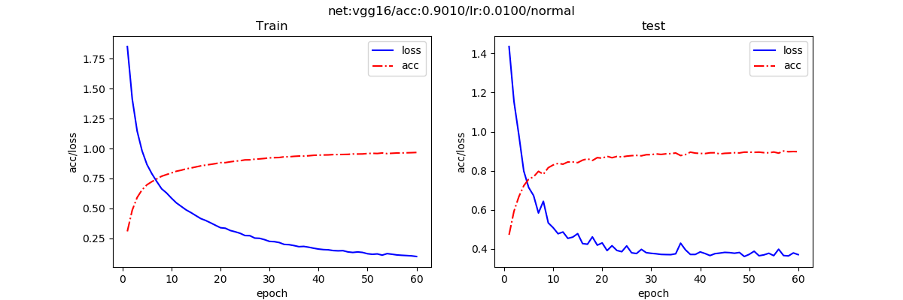
**After these two experiments, I find that the data is very important to the performance of CNN models!**
However, I still want to check out whether other factors, such as auto-adjust lr and optimization methods etc. can make a difference on CNN's performance

## 5. Results for using pytorch lab to adjust learning rate automaticly on augmented set
> 
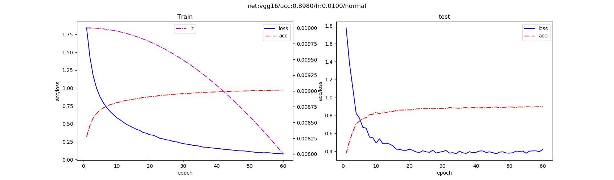

## 5. Results for using different models
> The result on resnet50:
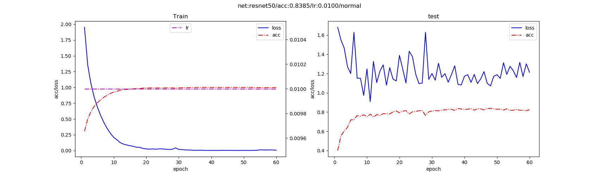

